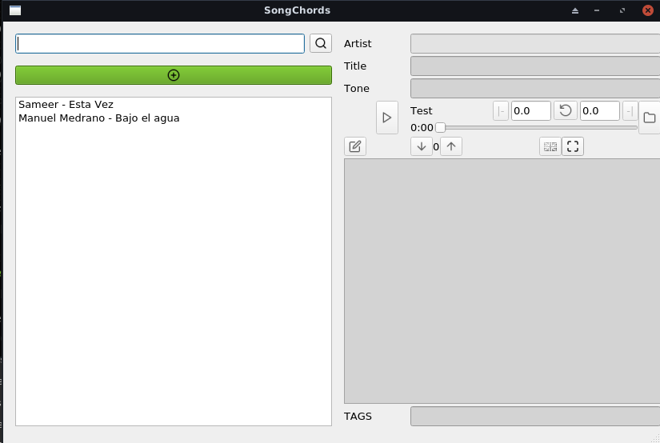
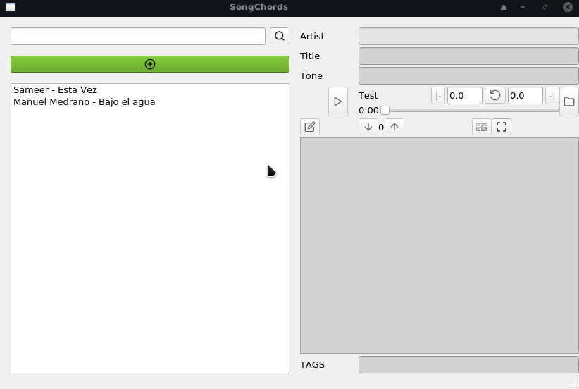
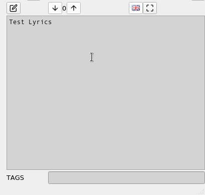
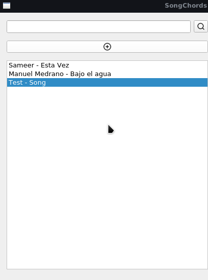
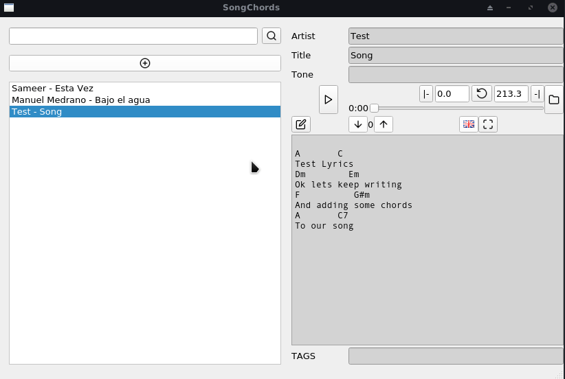
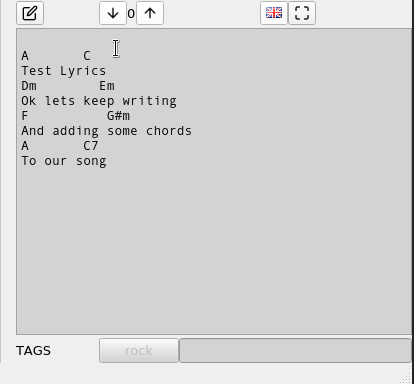
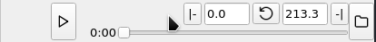
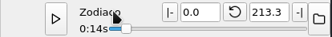

# SongChords

A simple powerful tool for managing songs lyrics and chords

## DOWNLOAD

https://github.com/wolfred24/SongChords/releases/tag/v0.1

## DEMOSTRATION

Main window:

Save your favorite songs chords and lyrics in an ordered manner and visualize them whenever u want:

Create new songs and begin the song writing/ transcribing process:

Search trough all your created songs:

Tag system to easily find and organize your songs:

Easily change song chords tones:

Add mp3 to every entry and play them along your song writing/transcribing experience, or play your instrument along with the music:

Create loops on your audio files and listen to each part of the audio repetitively:

